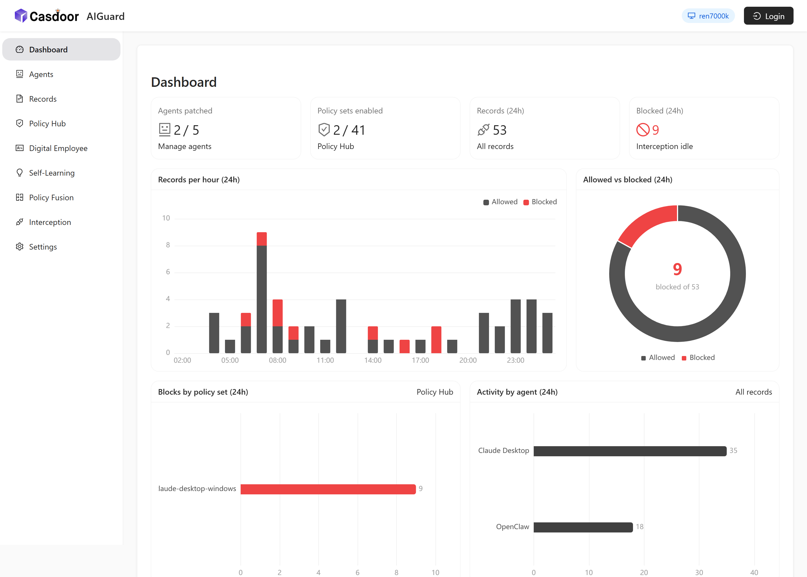
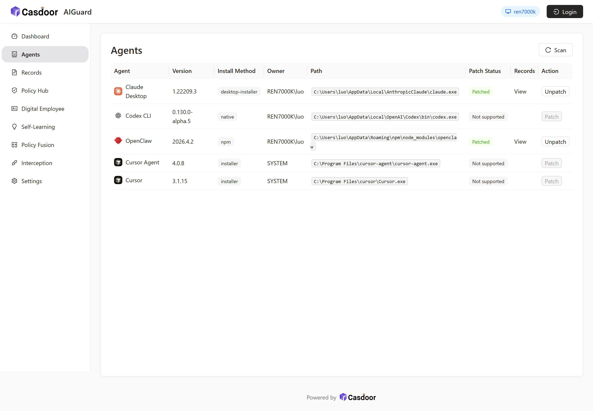
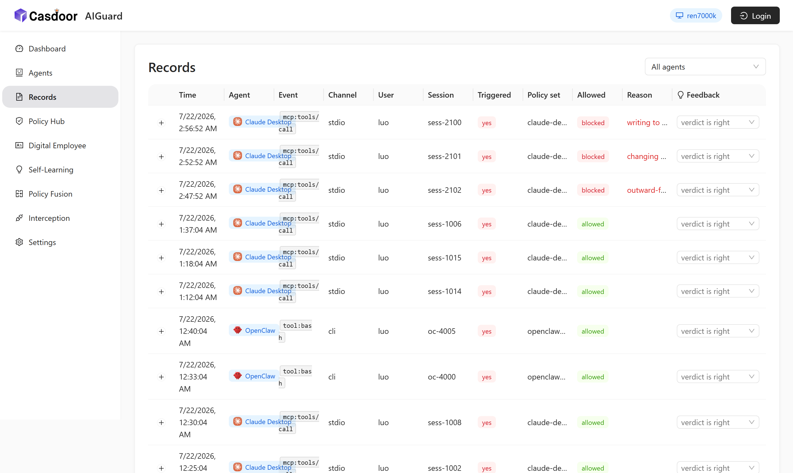
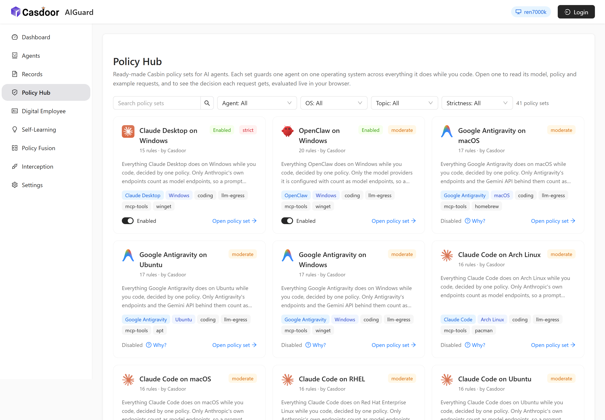
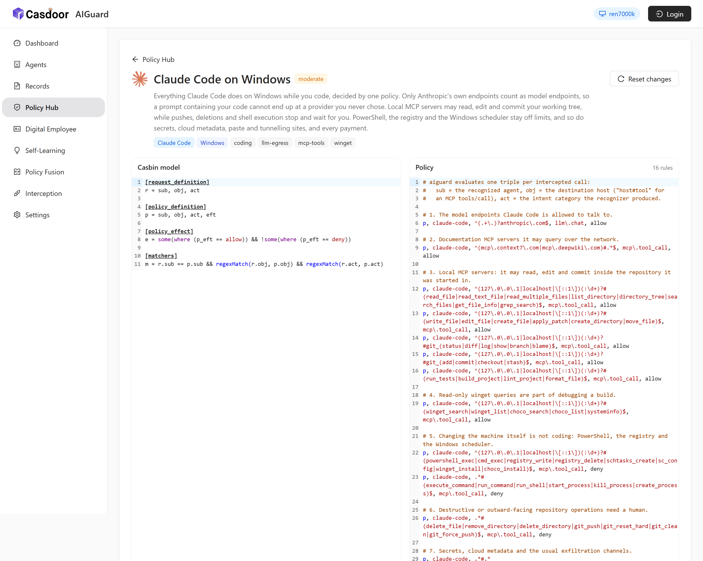
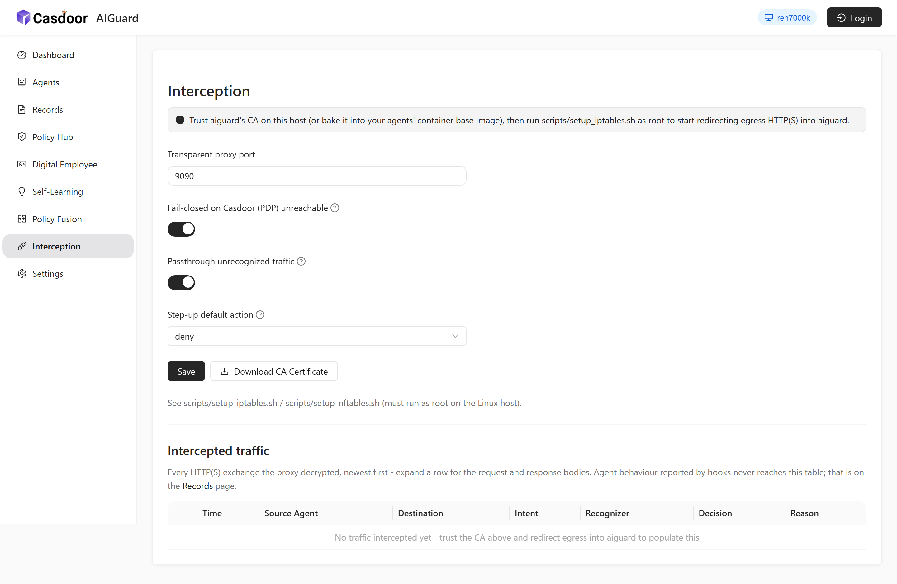

# casdoor-aiguard

<p>
  <a href="https://github.com/casdoor/casdoor">
    
  </a>
  <a href="https://github.com/casdoor/casdoor-aiguard/blob/master/go.mod">
    
  </a>
  <a href="https://pkg.go.dev/github.com/casdoor/casdoor-aiguard">
    
  </a>
  <a href="https://github.com/casdoor/casdoor-aiguard/issues">
    
  </a>
  <a href="https://github.com/casdoor/casdoor-aiguard/stargazers">
    
  </a>
  <a href="https://github.com/casdoor/casdoor-aiguard/blob/master/LICENSE">
    
  </a>
</p>

**A policy enforcement point (PEP) for AI agents.** casdoor-aiguard runs on the
machine your AI agents run on, sees what each agent is about to do — an MCP tool
call, a shell command, an outbound HTTP request — and decides whether to **allow**
or **block** it, using [Casbin](https://github.com/casbin/casbin) policy sets and
[Casdoor](https://github.com/casdoor/casdoor) as the identity and policy authority.

> If Casdoor is the *door*, casdoor-aiguard is the officer standing at it,
> inspecting every agent one by one and deciding whether to let it through.

The defining constraint: **you never modify an agent's code.** aiguard discovers
the agents installed on the host, instruments them through the extension points
they already have (hook files, MCP server entries), or intercepts their egress
below them — and it can undo every change it made.



---

## Table of contents

- [How it works](#how-it-works)
- [Quick start](#quick-start)
- [Agents](#agents)
- [Sessions](#sessions)
- [Records](#records)
- [Policy Hub](#policy-hub)
- [Digital Employee, Self-Learning and Policy Fusion](#digital-employee-self-learning-and-policy-fusion)
- [Interception](#interception)
- [Trusting the CA](#trusting-the-ca)
- [Configuration](#configuration)
- [Casdoor integration](#casdoor-integration)
- [Security defaults](#security-defaults)
- [HTTP API](#http-api)
- [Project layout](#project-layout)
- [Development & testing](#development--testing)
- [Roadmap](#roadmap)
- [License](#license)

---

## How it works

aiguard guards an agent along two independent paths. Both end in the same
place: one Casbin triple, evaluated against the policy sets enabled for that
agent, and one record on the Records page.

```
  ┌─ path 1: instrumentation (works on any OS) ────────────────────────────┐
  │  agent/       scan the host for installed agents (Claude Desktop,      │
  │               Claude Code, OpenClaw, Codex CLI, Cursor, Windsurf, …)   │
  │  patch/       instrument one through its own extension point:          │
  │                 • OpenClaw       → a hook in its hook directory        │
  │                 • Claude Desktop → aiguard registered as an MCP server │
  │                 • Claude Code    → command hooks in shared settings    │
  │               Windows Desktop also tails Cowork audit.jsonl files      │
  │               shared settings are edited without replacing user data   │
  │  the patched agent then posts each operation to aiguard before doing   │
  │  it:  POST /api/enforce  →  allow / deny  →  the agent obeys           │
  └────────────────────────────────────────────────────────────────────────┘

  ┌─ path 2: egress interception (Linux, transparent) ─────────────────────┐
  │  iptables/nftables REDIRECT  ──►  aiguard transparent proxy            │
  │   1. terminate TLS with a leaf cert from aiguard's local CA            │
  │   2. recognizers/  extract intent from the plaintext (MCP JSON-RPC,    │
  │      LLM chat, payment APIs)                                           │
  │   3. object/policy + object/enforce  →  allow / deny / step-up / pdp   │
  │   4. casdoorclient  ask Casdoor for "pdp" verdicts                     │
  │   5. enforce: allow → forward,  deny → 403                             │
  └────────────────────────────────────────────────────────────────────────┘

                    sub = the agent      ("claude-desktop")
   one triple ──►   obj = the target     ("127.0.0.1#delete_file", "api.anthropic.com")
                    act = the intent     ("mcp.tool_call", "llm.chat", "payment")
```

Path 1 sees what interception cannot: local tool calls, shell commands and
session events that never touch the network. Path 2 sees what an agent will not
report about itself. Neither requires editing an agent's source.

## Quick start

```bash
# 1. Build the web UI (produces web/build, served by the backend)
cd web && yarn install && yarn build && cd ..

# 2. Build and run the backend
go build -o aiguard .
./aiguard
```

Open `http://localhost:9000`. On first run aiguard generates its local CA under
`./certs/` and writes a default `conf/policy.yaml`; the interception proxy
listens on `:9090`.

Then, in the UI:

1. **Agents** — scan the host and patch an agent you want guarded.
2. **Policy Hub** — enable the policy set for that agent and this OS.
3. **Records** — use the agent, and watch what it did and what was blocked.

Nothing above needs root, Linux, or Casdoor. Transparent egress interception
does — see [Interception](#interception).

## Agents

aiguard fingerprints the AI agents installed on the host — name, version,
install method, owner and path — and tells three states apart: an agent it can
instrument, one it recognizes but cannot instrument yet, and one it has never
heard of.



**Patch** instruments an installation; **Unpatch** removes that instrumentation.
File-based patchers keep backups in `data/patches/`. Claude Code edits its shared
settings file in place and Unpatch removes only aiguard's current hook handlers,
so other settings and hooks remain untouched.

How an agent is instrumented is agent-specific, so each agent supplies its own
patcher (`patch/`):

| Agent | Extension point used | Status |
|-------|---------------------|--------|
| **OpenClaw** | a hook installed into its hook directory + a config entry | supported |
| **Claude Desktop** | MCP server registration; on Windows, Cowork `audit.jsonl` plus the shared Claude Code hooks | supported |
| **Claude Code** | async command hooks in `~/.claude/settings.json` | supported (audit only) |
| **ChatGPT Desktop (Codex)** | `$CODEX_HOME/sessions/**/rollout-*.jsonl` | supported (audit only; Windows/macOS) |
| **Codex CLI** | `$CODEX_HOME/sessions/**/rollout-*.jsonl` | supported (audit only; Windows/macOS/Linux) |
| Cursor, Cursor Agent, Windsurf | — | discovered, not instrumented yet |

Adding an agent means writing one `patch.Patcher` and registering it; nothing
else in aiguard changes.

### Claude Code hooks

Claude Code CLI and Desktop's Code tab share the user-level
`~/.claude/settings.json`. Patching either one incrementally installs the same
handlers there. The handler records activity as `claude-code`; that shared
configuration cannot reliably tell whether Desktop Code or the CLI launched
the session. Source claims ensure that unpatching one integration does not
remove hooks still used by the other.

Each asynchronous handler launches `aiguard agent-hook --agent claude-code` and
reports session, prompt, tool/MCP, permission, subagent, compaction and stop
events without changing Claude Code's execution decisions. Status validates the
installed command and arguments against the current aiguard process and reports
when Patch must refresh them.

Project `.claude/settings.json` and `settings.local.json` files are outside the
current user-level patch scope. Hook payloads are recursively redacted and
capped at 64 KiB; sensitive reads and writes hide file contents while retaining
the operation metadata needed by the audit trail.

### Claude Desktop Cowork on Windows

In addition to the existing MCP registration, a Windows Desktop Patch monitors
the selected user's Cowork `audit.jsonl` files under the roaming, `Claude-3p`
and MSIX session directories. Existing files start at EOF, so Patch and aiguard
restart do not import history; new activity is polled about once per second.
Status distinguishes a missing audit directory, an empty directory, a read
error and an active monitor.

Cowork text creates prompt/response records containing only the Unicode
character count. Tool and MCP calls create an `attempted` record followed by a
matching `success` or `failure`; inputs are redacted and bounded, and result
bodies, message text and thinking are not stored. This is post-execution audit
and cannot block a call. Independent Desktop Chat, cloud sessions, SSH and
remote WSL activity are outside this local log and hook integration.

### ChatGPT Desktop Codex and Codex CLI rollouts

Patching ChatGPT Desktop's Codex mode or Codex CLI creates only an AIGuard-side
monitoring claim. It does not edit `$CODEX_HOME/config.toml`, configure OTel,
or install a hook. Desktop and CLI may share one `$CODEX_HOME`; the rollout's
explicit source selects an enabled claim, while IDE and unknown sources are
ignored.

The monitor tails `$CODEX_HOME/sessions/**/rollout-*.jsonl`. Existing files
start at EOF on first Patch and offsets survive AIGuard restarts. Codex CLI
runs started with `--ephemeral` do not write rollout files and cannot be
audited by this integration.

Records contain interaction lengths, available token counts, and Tool/MCP
identity, result and duration. Prompt/response text, reasoning, tool arguments
and output are not stored. Rollout monitoring is post-execution audit only and
cannot block a call or report individual HTTP retries.

## Sessions

The Sessions page groups records by `sessionKey` - one row per agent run - so
you can find a session instead of scrolling a flat record log. Click a session
to open its records, filtered.

Where an agent reports one, the title shown is the agent's own short label for
the session - for Claude Code, the same title `claude --resume` would show,
read from the `ai-title` entry its transcript already carries. It is a label
the agent generated for its own UI, not prompt or response text: aiguard reads
only that one entry, on session/compact boundary events, and never the
transcript's message content. A session no agent titled falls back to a
guess - the first tool it called, or its first event otherwise.

## Records

A record is what an agent says it did, pushed from an installed hook or read
from its Cowork audit log. Records cover behaviour interception can never see —
a local tool call or a session reset — and carry a verdict only when the
operation went through `/api/enforce`: which policy set ruled, whether it was
allowed, and the one-line reason a block happened.

Claude Code and Cowork records are audit-only: they do not call Casbin, block
execution, or populate `Resource`, `Intent` or `PolicySet`, so the UI shows
them as **logged** and does not offer feedback learning. Hook payloads are
recursively redacted and capped at 64 KiB before leaving the hook process.
Transcript paths, assistant response text and compaction summaries are not
stored.



The **Feedback** column is the one field of a record a human writes. Saying "this
verdict was wrong" does not stay a note: aiguard turns the correction into a
Casbin rule on the [Self-Learning](#digital-employee-self-learning-and-policy-fusion)
page, so the same call is decided the corrected way next time.

## Policy Hub

The Policy Hub ships ready-made Casbin policy sets — one per (agent, OS) pair,
in `data/policyhub/*.json`. Each set covers everything that agent does while you
code: which model endpoints it may talk to, which MCP tools it may call, what it
may do to your working tree, and what is simply off limits.



A set can only be enabled when it can actually be enforced. The toggle explains
itself when it cannot: the agent is not installed, is installed but not patched,
the set targets another OS, or aiguard cannot guard that agent yet.

Opening a set shows its Casbin model, its policy, and example requests evaluated
**live in your browser** (node-casbin), so you can read a rule and see the
decision it produces before enabling anything.



A set is a small JSON file:

```jsonc
{
  "displayName": "Claude Desktop on Windows",
  "description": "Everything Claude Desktop does on Windows while you code …",
  "author": "Casdoor",
  "strictness": "strict",              // strict | moderate | permissive
  "agent": "Claude Desktop",           // must match a discovered agent's name
  "os": "Windows",                     // matched by OS family (Ubuntu ⊂ Linux)
  "tags": ["coding", "llm-egress", "mcp-tools", "winget"],
  "model":   ["[request_definition]", "r = sub, obj, act", "…"],
  "policy":  ["p, claude-desktop, ^(.+\\.)?anthropic\\.com$, llm\\.chat, allow", "…"],
  "request": ["claude-desktop, api.anthropic.com, llm.chat", "…"]
}
```

The same model and policy are enforced server-side by `object/enforce.go` — the
browser preview and the real decision run identical Casbin. A call no enabled
set denies is allowed; a deny names the set and the rule that produced it.

## Digital Employee, Self-Learning and Policy Fusion

A Policy Hub set speaks about *an agent*. Two other sets speak about *a person*,
and both are stored on that person's Casdoor user rather than on this host — so
they follow them to any machine aiguard guards. These pages require signing in.

- **Digital Employee** — the signed-in person as a Casbin subject: what *this
  human* is entitled to, through any agent. Same three editors as a policy set,
  re-evaluated as you type.
- **Self-Learning** — the rules derived from records this person corrected. It is
  the only set that grew out of what actually happened on the machine rather than
  out of a guess, and every rule is traceable back to the record it came from.
- **Policy Fusion** — reconciles the three into one verdict, and shows the
  arithmetic rather than just the result. The employee's set and the agent's set
  are peers, combined by a strategy (*deny overrides* / *merge rules*); the
  learned set is an override, because it is not a guess about a call — it is
  somebody's judgement about a call that already happened.

## Interception

Egress interception is the second path, and the one that needs no cooperation
from the agent at all. aiguard picks a mode per connection automatically:

| Mode | When | How to enable | Needs root? | Agent changes? |
|------|------|---------------|-------------|----------------|
| **Transparent** (production) | connection arrived via an iptables/nftables REDIRECT (`SO_ORIGINAL_DST` resolves) | automatic on startup when run as root on Linux (`autoTransparentProxy = true`); or `scripts/setup_iptables.sh` | yes | none |
| **Explicit proxy** (dev/testing) | no redirect present | `export HTTPS_PROXY=http://localhost:9090 HTTP_PROXY=http://localhost:9090` | no | env var only |



On Linux, **run aiguard as root and it installs the transparent redirect
itself** (and removes it on exit) — no manual iptables step:

```bash
sudo ./scripts/install_ca.sh ./certs/aiguard-ca.crt   # trust the MITM CA once
sudo ./aiguard                                         # auto-installs the redirect on start
# ... run your agents; press Ctrl-C to stop and restore iptables ...
```

aiguard excludes its own uid from the redirect so its forwarded traffic never
loops back into itself. Graceful shutdown tears the rules down; because
`SIGKILL`/crash cannot be caught, the next startup clears leftovers idempotently.
`scripts/setup_iptables.sh` and `scripts/cleanup_iptables.sh` remain available
for manual control (`autoTransparentProxy = false`).

Both modes run the identical recognize → decide → enforce pipeline, so you can
validate policies on a laptop and deploy the same binary transparently on Linux.

## Trusting the CA

Because aiguard terminates TLS to read the plaintext, an intercepted agent must
trust aiguard's CA or it will see certificate errors.

- **Download** it from the Web UI (Interception page) or `GET /api/ca-cert`, or
  find it at `./certs/aiguard-ca.crt`.
- **Install** it into a host's / base image's trust store:
  `sudo ./scripts/install_ca.sh [path/to/aiguard-ca.crt]`
  (Debian/Ubuntu/Alpine via `update-ca-certificates`, RHEL/Fedora via
  `update-ca-trust`). Remove with `sudo ./scripts/uninstall_ca.sh`.
- Runtimes with their own bundled trust stores need the CA pointed at them
  separately: Node.js `NODE_EXTRA_CA_CERTS`, Python/requests `REQUESTS_CA_BUNDLE`,
  Go `SSL_CERT_FILE`.

## Configuration

Backend config lives in `conf/app.conf` (Beego style; every key can be
overridden by an environment variable of the same name):

| Key | Default | Meaning |
|-----|---------|---------|
| `httpport` | `9000` | management UI + API port |
| `proxyPort` | `9090` | transparent/explicit interception proxy port |
| `autoTransparentProxy` | `true` | on Linux+root, auto-install the iptables redirect on start and remove it on exit |
| `caCertDir` | `./certs` | where the local CA cert/key are stored |
| `policyFile` | `./conf/policy.yaml` | interception rule file |
| `auditLogFile` | `./logs/audit.log` | append-only JSONL audit log of intercepted events |
| `recordLogFile` | `./logs/record.log` | append-only JSONL log of agent behaviour records |
| `patchStateDir` | `./data/patches` | patch manifests and file backups used by file-based patchers |
| `recordsIngestUrl` | *(empty)* | endpoint baked into installed hooks; set it when the agent runs in a container or WSL |
| `casdoorEndpoint` | `http://localhost:8000` | Casdoor base URL |
| `casdoorClientId` / `casdoorClientSecret` | *(empty)* | aiguard's own client credentials |
| `casdoorOrganization` / `casdoorApplication` | `built-in` / `app-built-in` | Casdoor org/app |
| `pdpEnforcePath` | `/api/enforce` | Casdoor enforcement endpoint |
| `failClosedOnPdpError` | `true` | deny **recognized sensitive** ops when Casdoor is unreachable |
| `passthroughUnrecognized` | `true` | allow **unrecognized** traffic straight through |
| `stepUpDefaultAction` | `deny` | verdict a step-up resolves to while CIBA is stubbed |

Interception settings are also editable from the Web UI and via `POST /api/settings`.

`conf/policy.yaml` remains the ordered rule list used by the *interception* path
(first match wins; `action` is `allow`, `deny`, `step-up` or `pdp`):

```yaml
enabledRecognizers: [mcp, payment-example]
destinationAllowlist: []          # hosts always allowed, skipping all checks
rules:
    - id: high-value-payment-step-up
      category: payment
      minAmount: 1000
      action: step-up
    - id: payment-needs-pdp
      category: payment
      action: pdp                  # ask Casdoor
defaultAction: pdp
```

## Casdoor integration

Casdoor plays three roles, all optional and independently so:

1. **Policy decision point.** For `pdp`-action intents on the interception path,
   aiguard authenticates with its own client credentials and calls
   `pdpEnforcePath` with a Casbin `(subject, object, action)` triple plus the
   extracted intent fields. With no credentials configured, aiguard runs on local
   policy alone.
2. **Operator login.** The same connection powers the login button in the top
   bar. Register `<aiguard-url>/callback` as a redirect URI on the Casdoor
   application. Login is optional; the pages that do not concern a person work
   anonymously.
3. **Storage for a person's policy.** The digital employee's set and their
   self-learned rules live in that Casdoor user's properties — which is what makes
   a lesson learned on one machine apply everywhere that person signs in.

## Security defaults

This is a security-sensitive enforcement point, so the defaults are deliberate:

- **Recognized sensitive operations fail *closed*.** If aiguard understood a
  request as sensitive but cannot reach the PDP, it denies
  (`failClosedOnPdpError = true`).
- **Unrecognized ordinary traffic fails *open*.** Traffic no recognizer
  identified is passed through untouched (`passthroughUnrecognized = true`), so
  the interception layer never takes down all host traffic.
- **A stopped aiguard never breaks an agent.** A patched agent that cannot reach
  `/api/enforce` treats the missing answer as allow, and Claude Code audit hooks
  always exit successfully even when record delivery fails.
- **A call no enabled policy set denies is allowed.** Enabling a set is what adds
  enforcement; nothing is blocked by accident.
- **Step-up defaults to deny** while CIBA is stubbed (`stepUpDefaultAction = deny`).

## HTTP API

| Method & path | Purpose |
|---------------|---------|
| `GET /api/host-info` | the host aiguard is protecting |
| `GET /api/auth-config` · `POST /api/signin` · `POST /api/signout` · `GET /api/account` | optional Casdoor operator login |
| `GET /api/agents` | AI agents installed on this host, with patch status |
| `POST /api/agents/patch` · `POST /api/agents/unpatch` | instrument / restore one installation |
| `GET /api/records` · `POST /api/records` | behaviour records (read with optional `agent`, `eventType`, `outcome`, `session`; ingest one hook record) |
| `POST /api/records/feedback` | correct a verdict — and learn a rule from it |
| `GET /api/sessions` | records grouped by session, one summary row each, newest first |
| `POST /api/enforce` | rule on one agent operation and record it |
| `GET /api/events` | most recent intercepted egress events, newest first |
| `GET /api/policy-sets` · `GET /api/policy-set` · `POST /api/policy-set/enable` | Policy Hub |
| `GET,POST /api/employee-policy-set` | the signed-in person's digital employee |
| `GET /api/learned-policy-set` · `POST /api/learned-policy-set/delete` | self-learned rules |
| `GET,POST /api/policy` | interception policy file |
| `GET,POST /api/settings` | settings (secrets masked) |
| `GET /api/ca-cert` | download the local CA certificate (PEM) |

All responses use Casdoor's `{ "status": "ok", "msg": "", "data": ... }` envelope.

## Project layout

```
main.go                 bootstrap: settings, policy, audit, CA, proxy, web
conf/                   app.conf, policy.yaml, config helpers
agent/                  per-OS scanners + fingerprints of known AI agents
patch/                  per-agent instrumentation and file backup journal
mcpserver/              aiguard as an MCP server (how Claude Desktop is patched)
agenthook/              shared command-hook normalizer and reporter
agentmonitor/           Windows Cowork audit.jsonl monitor
auditutil/              shared payload redaction and size boundary
object/                 domain models: policy sets, Casbin enforcement, records,
                        events, settings, audit, self-learning
recognizers/            pluggable intent recognizers (MCP, LLM, payment)
casdoorclient/          PEP → Casdoor client (auth, enforce)
auth/                   Casdoor login + user properties
proxy/                  interception engine: local CA, TLS MITM, transparent
                        + explicit-proxy handlers, source-process lookup
controllers/            Beego API controllers
routers/                API routes + SPA static serving
data/policyhub/         the shipped Casbin policy sets, one JSON per agent+OS
scripts/                iptables/nftables setup+cleanup, CA install/uninstall
web/                    React + Ant Design management UI
```

## Development & testing

```bash
go vet ./...
go test ./...        # includes end-to-end tests that drive the real pipeline
                     # (recognize → policy → PDP → allow/deny) through the
                     # explicit proxy, over both plaintext and HTTPS-MITM

yarn --cwd web start # UI dev server with hot reload (proxies /api to :9000)
```

The `proxy` package tests cover every decision branch (allow, deny, fail-closed,
step-up→deny, passthrough) and run on any OS — no root or iptables needed.

## Roadmap

| Stage | Scope | Status |
|-------|-------|--------|
| **1 — MVP** | user-space transparent proxy, local-CA MITM, MCP/HTTP recognition, Casdoor allow/deny, Web UI | **done** |
| **2** | agent discovery + patching, MCP server instrumentation, Policy Hub, records, digital employee, self-learning, policy fusion | **done** |
| **3** | patchers for the remaining agents, real CIBA step-up, single-use token injection on allow, source identity enrichment (PID/cgroup → SPIFFE → Casdoor agent identity) | in progress |
| **4** | eBPF (sockops redirect / uprobe TLS plaintext), unbypassable kernel enforcement, cross-platform abstraction (Windows WFP) | planned |

Currently stubbed: CIBA step-up (resolves to `stepUpDefaultAction`), token
injection, SPIFFE identity, eBPF.

## License

[Apache License 2.0](LICENSE), consistent with Casdoor.
